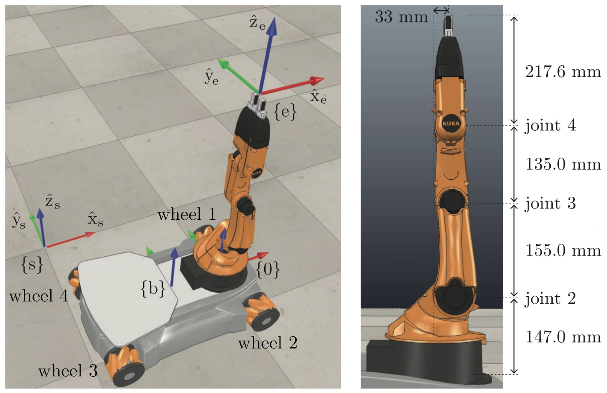
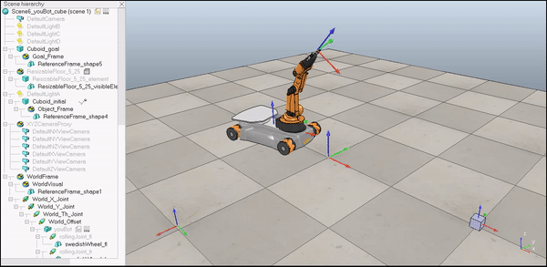
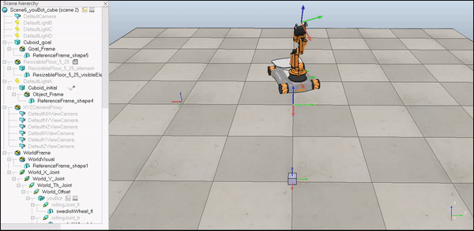
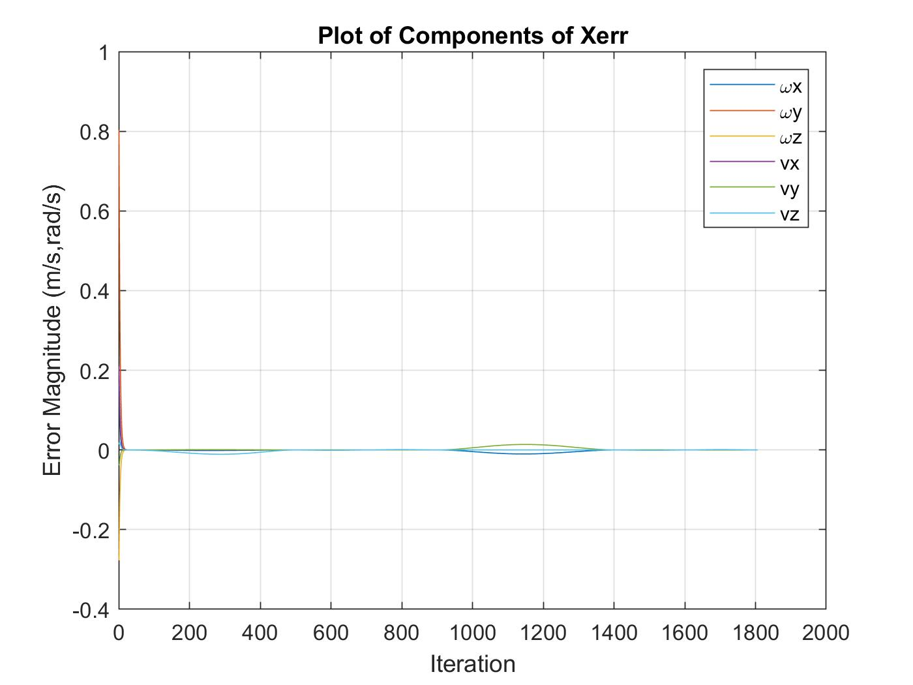
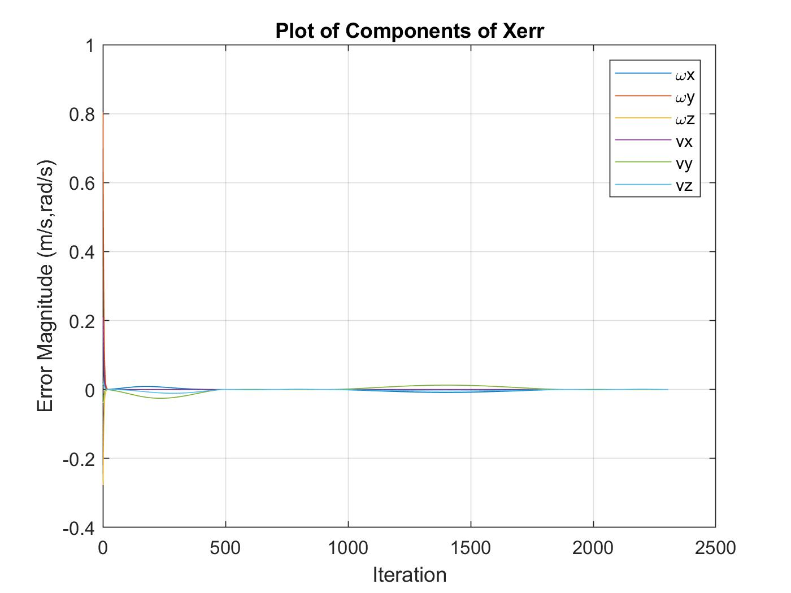
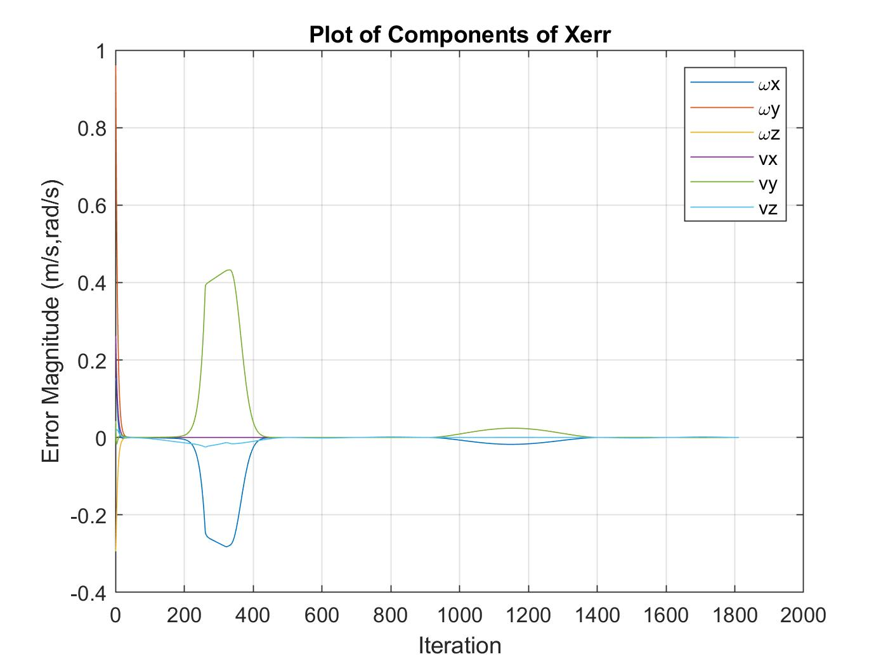

# Mobile Manipulation Project
Final project for ME 449: Robotic Manipulation, Northwestern University, Fall 2019.

## Overview
This project consisted of controlling a simulated mobile manipulator to carry a block from its initial configuration to a goal configuration. The simulation engine used was V-REP (now CoppeliaSim), and trajectory and kinematics calculations were done using MATLAB.

## The Robot
The mobile manipulator, called the "youBot", consists of a mobile base with four mecanum wheels and a 5R robot arm. Its configuration can be represented using the following 13 degrees of freedom: chassis phi, chassis x, chassis y, J1, J2, J3, J4, J5, W1, W2, W3, W4, gripper state. J1 to J5 are the arm joint angles and W1 to W4 are the four wheel angles.
 
 

## Workflow
The MATLAB software first creates a reference trajectory that the youBot is meant to follow. It then performs odometry as well as feedback control calculations to move and simulate the robot as close as possible to the trajectory. During the trajectory, the robot picks-and-places a cube of known parameters in specified locations. The process can be separated into the following steps:
1. Creating a desired trajectory.
2. Initializing values and parameters that are used by functions, such as dimensions, max
speed, and timesteps.
3. Iterating through each step of the desired trajectory and:
   1. Calculating control law to generate wheel and joint controls that move current configuration to desired configurations.
   2. Feeding these controls to a function that creates and builds the actual trajectory.
   3. Storing errors for later data visualization and analysis.
4. Plotting and exporting error data.
5. Exporting .csv file of actual trajectory (robot configuration as a function of time).

## Demos
The first demo, whose code can be found in the `results/best_run` directory, showcases a proper run of a pick-and-place trajectory:

The second demo, whose code can be found in the `results/new_task` directory, showcases a proper run of an alternate pick-and-place trajectory:

The third demo, whose code can be found in the `results/overshoot` directory, showcases a run in which the robot overshoots its trajectory target.

## Usage
The main script file is `code/runscript.m`. It asks the user for inputs that describe the desired trajectory and control gains. These input variables are specified in the `controller.txt` files in the `best_run`, `new_task`, and `overshoot` directories. Running the file outputs a `runscript.csv` file which contains the trajectory information for each degree of freedom of the robot at each timestep. This .csv file can be fed into a V-REP scene of the youBot to simulate its picking and placing of the block.

## Results
- `best_run`: This run exhibited very little error. The mobile manipulator was able to pick up, transport, and place down the cube very effectively.
   
  
   
- `new_task`: Very low errors again, on an even longer trajectory.
   
  
   
- `overshoot`: As mentioned in `overshoot/controller.txt`, increasing Kp too much (>2) led to unstable behavior (when keeping Ki at 0.8). This was an interesting way to observe how control gains can negatively affect the performance of a system. Best overshoot performance came when Kp = 1.98.
   
  
   

Success was found by:
1. Tuning the gain parameters Kp and Ki.
2. Tuning the length and speed of the reference trajectory segments so that the robot
wouldn’t drop a cube once it grabbed it or take too long grabbing it.
3. Increasing the parameter k (number of trajectory reference configurations per 0.01
seconds).
